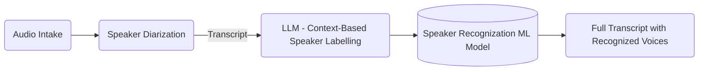

-----

# 🎙️ Live AI Speaker Identification System

A real-time audio analysis pipeline that combines **Voice Activity Detection (VAD)**, **Speech-to-Text (WhisperX)**, **Biometric Recognition (SpeechBrain)**, and **LLM Contextual Analysis (Gemma/Transformers)** to transcribe and identify speakers in a live web interface.



-----

## ✨ Features

  * **Live Web Dashboard:** Modern WebSocket-based UI built with FastAPI to view transcripts in real-time.
  * **Multi-Modal Identification:**
      * **Biometrics:** Uses `ECAPA-TDNN` embeddings to recognize voice fingerprints.
      * **Contextual ID:** Uses an LLM  to infer speaker names from the conversation context (e.g., "Hey Bob, how are you?").
  * **Active Learning:** Automatically extracts high-quality audio segments to retrain the speaker registry on the fly.
  * **Smart VAD:** Energy-based and Webrtcvad triggers to ignore silence and background noise.

-----
## 🖥️ Demo Video

[Youtube Link](https://youtu.be/BKfjboFLpIU)

-----


## 🛠️ Installation

### 1\. Prerequisite: Virtual Environment

Create and activate your Python environment:

```bash
python -m venv venv
# Windows
.\venv\Scripts\activate
# Mac/Linux
source venv/bin/activate
```

### 2\. Install PyTorch (GPU Specific)

**⚠️ Important:** Choose the command matching your NVIDIA GPU architecture.

**Option A: RTX 4000 Series or Older**

```bash
pip install torch==2.8.0 torchvision==0.23.0 torchaudio==2.8.0 --index-url https://download.pytorch.org/whl/cu126
```

**Option B: RTX 5000 Series+ (Blackwell Architecture)**

```bash
pip install torch==2.8.0 torchvision==0.23.0 torchaudio==2.8.0 --index-url https://download.pytorch.org/whl/cu128
```

### 3\. Run Uvicorn Server (Optional)

Install the server, audio processing, and AI libraries:

```bash
# Server components
pip install fastapi uvicorn python-multipart websockets python-dotenv

# Audio & AI components
pip install speechbrain transformers whisperx sounddevice wavio webrtcvad numpy scipy accelerator
```

*(Note: You must have [FFmpeg](https://ffmpeg.org/download.html) installed and added to your system PATH for audio processing)*

-----

## ⚙️ Configuration

1.  Create a `.env` file in the root directory.
2.  Add your Hugging Face token (required for Pyannote/WhisperX/Gemma access):

<!-- end list -->

```env
HF_TOKEN=hf_your_hugging_face_token_here
```

-----

## 🚀 Usage

### 1\. Start the Server

Launch the FastAPI backend with Uvicorn:

```bash
uvicorn server:app --host 0.0.0.0 --port 8000 --reload
```

### 2\. Access the Dashboard

Open your web browser and navigate to:

> **http://localhost:8000**

1.  Click **Start** to begin listening.
2.  The system will detect voice activity, transcribe it, and attempt to identify the speaker.
3.  If an LLM detects a name in the text, it overrides the biometric ID and updates the training database automatically.

-----

## 📂 Project Structure

| File | Description |
| :--- | :--- |
| `server.py` | Main entry point. Handles WebSockets, UI serving, and pipeline orchestration. |
| `recorder_threshold.py` | Handles microphone input and Voice Activity Detection (VAD). |
| `whisperx_component.py` | Handles transcription, alignment, and diarization. |
| `speechbrain_component.py` | Extracts audio features (MFCCs) and manages speaker data folders. |
| `speaker_recognition.py` | Compares live audio against the known `speaker_registry.pt`. |
| `llm_component.py` | Runs the LLM to guess speaker names based on conversation context. |
| `speaker_training.py` | Updates the registry model with new speaker embeddings. |

-----

## 🧠 System Pipeline

1.  **VAD:** Microphone listens for audio above the amplitude threshold.
2.  **Transcribe:** Audio is sent to **WhisperX** for high-accuracy text and timestamps.
3.  **Parallel Identification:**
      * *Path A (Bio):* **SpeechBrain** extracts an embedding and compares it to `speaker_registry.pt`.
      * *Path B (LLM):* **Gemma** reads the transcript to find names (e.g., "Hello **Bob**").
4.  **Merge:** The system merges the results. (LLM decisions take priority and trigger retraining).
5.  **Broadcast:** Results are sent via WebSocket to the HTML frontend.

## 📝 To- Do Improvements ( Will work on down the line)
 - Improve Contextual Identification, sliding window over speakers behind in the past identifying them(re-identify, use lighter methods)
 - Improve the Hybrid model by making it adapt to speakers long term voice training (People using different contexts)
 - Create different timings for tutorial to use for different conversations aiming
 - Adaptive conversation timing stopping

## *Note*
- If you want to experiment with other LLM speaker context identification, feel free to modify the LLM component model and make sure to get access to those other models.
