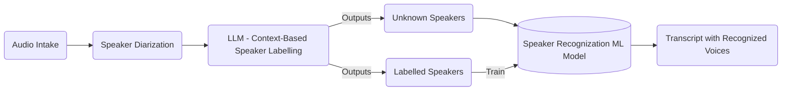

```mermaid
graph LR;
    A(Audio Intake)
    SD(Speaker Diarization) 
    LLM(LLM - Context-Based Speaker Labelling)
    US(Unknown Speakers)
    LS(Labelled Speakers)
    DB[(Speaker Recognization ML Model)]
    A --> SD
    SD --> LLM 
    LLM -->|Outputs| US
    LLM -->|Outputs| LS
    US--> DB;
    LS-->|Train| DB;
    DB --> TR(Transcript with Recognized Voices)
```