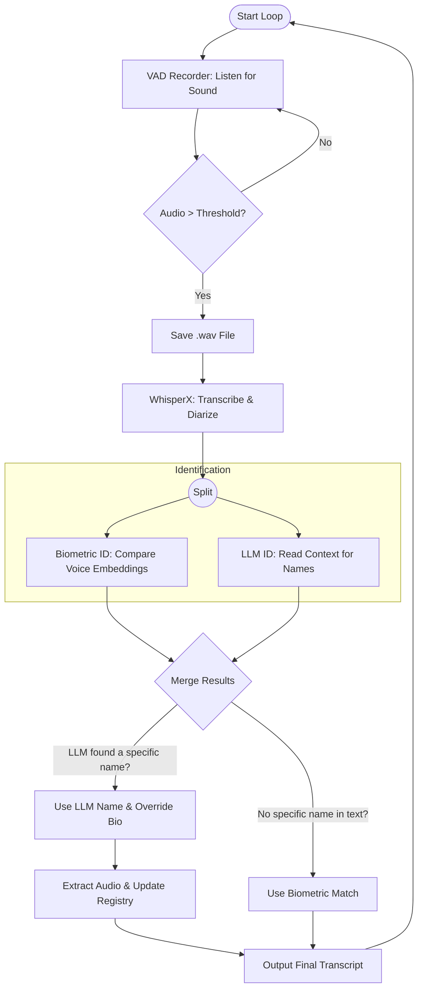

```mermaid
graph TD
    %% Initial State
    Start([Start Loop]) --> Listen[VAD Recorder: Listen for Sound]
    
    %% Voice Activity Detection
    Listen --> Detect{Audio > Threshold?}
    Detect -- No --> Listen
    Detect -- Yes --> Record[Save .wav File]

    %% Processing Stage
    Record --> Process[WhisperX: Transcribe & Diarize]
    
    %% Parallel Identification Logic
    Process --> Parallel((Split))
    
    subgraph Identification
        Parallel --> Bio[Biometric ID: Compare Voice Embeddings]
        Parallel --> LLM[LLM ID: Read Context for Names]
    end
    
    %% Merge Logic
    Bio --> Merge{Merge Results}
    LLM --> Merge
    
    Merge -- "LLM found a specific name?" --> YesOverride[Use LLM Name & Override Bio]
    Merge -- "No specific name in text?" --> NoBio[Use Biometric Match]
    
    %% Training & Output
    YesOverride --> Train[Extract Audio & Update Registry]
    Train --> Display[Output Final Transcript]
    NoBio --> Display
    
    %% Loop
    Display --> Start
```